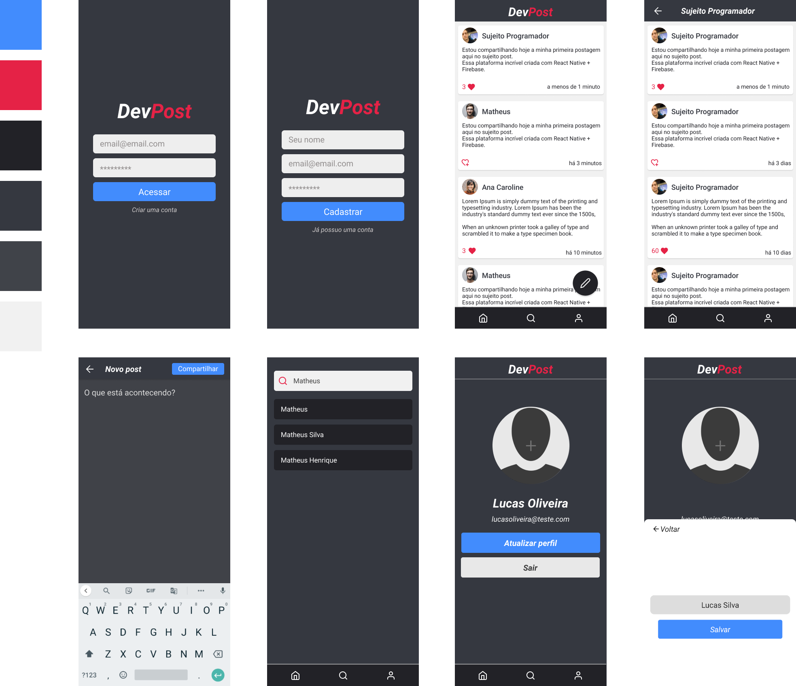

<h1 align="center">
    
</h1>
 

## Rede social para desenvolvedores

### Projeto de estudos do curso [Sujeito Programador](https://sujeitoprogramador.com/)
 
 

  

 
 

## 🚀 Tecnologias

Esse projeto foi desenvolvido com as seguintes tecnologias:

- ✔️ React Native
- ✔️ Styled Components
- ✔️ Contexts API
- ✔️ Firebase
- ✔️ React Navigation
- ✔️ React Native Animatable

 

### Instagram: [@tenoriogah](https://www.instagram.com/tenoriogah)
